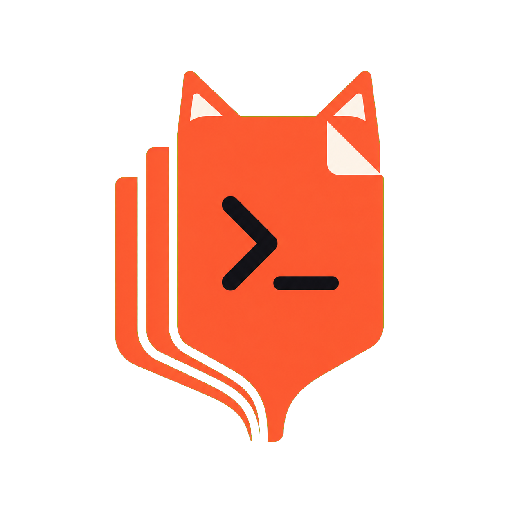

# promptcat

<p align="center">
    
</p>

[](https://github.com/Vortex93/promptcat/actions/workflows/ci.yml)

`promptcat` turns a set of source or text files into one prompt-friendly document.

It is designed for the common workflow of collecting a focused slice of a repository and pasting it into ChatGPT, Claude, Copilot Chat, or another LLM without manually opening and copying files one by one.

```text
<<<FILE: "cmd/promptcat/promptcat.go">>>
package main
...
<<<END FILE>>>
```

## Why promptcat

- Concatenate multiple files into one stable text stream
- Expand glob patterns inside the tool for predictable cross-shell behavior
- Filter inputs with `--include`, `--exclude`, `--ignore-dir`, and positional `!pattern` exclusions
- Skip binary files automatically by extension and content detection
- Output relative paths by default or absolute paths with `--fullpath`
- Create deterministic TAR + Zstandard archives with `promptcat archive`

## Installation

`promptcat` currently installs from source with Go.

Requirements:
- Go `1.27` or newer

### Windows

PowerShell:

```powershell
go install github.com/Vortex93/promptcat/cmd/promptcat@latest
promptcat --version
```

If `promptcat` is not found, add `$(go env GOPATH)\bin` to your `PATH`.
The default location is usually `%USERPROFILE%\go\bin`.

Current terminal session:

```powershell
$env:Path += ";$(go env GOPATH)\bin"
```

### macOS

```bash
go install github.com/Vortex93/promptcat/cmd/promptcat@latest
promptcat --version
```

If `promptcat` is not found, add `$(go env GOPATH)/bin` to your `PATH`.
The default location is usually `~/go/bin`.

Current terminal session:

```bash
export PATH="$(go env GOPATH)/bin:$PATH"
```

### Linux

```bash
go install github.com/Vortex93/promptcat/cmd/promptcat@latest
promptcat --version
```

If `promptcat` is not found, add `$(go env GOPATH)/bin` to your `PATH`.
The default location is usually `~/go/bin`.

Current terminal session:

```bash
export PATH="$(go env GOPATH)/bin:$PATH"
```

### Build From a Clone

```bash
git clone https://github.com/Vortex93/promptcat.git
cd promptcat
go test ./...
```

Build the binary locally into `bin/`:

macOS and Linux:

```bash
go build -o bin/promptcat ./cmd/promptcat
```

Windows:

```powershell
go build -o bin/promptcat.exe ./cmd/promptcat
```

## Quick Start

Collect all Go files under `cmd/`:

```bash
promptcat "cmd/**/*.go"
```

Collect only Go and Markdown files while ignoring noisy directories:

```bash
promptcat --include=go,md --ignore-dir=.git,node_modules "**/*"
```

Include absolute paths in the output:

```bash
promptcat --fullpath README.md "cmd/**/*.go"
```

Write the result to a file you can paste elsewhere:

```bash
promptcat --include=go,md README.md "cmd/**/*.go" > prompt.txt
```

Skip files larger than 1 MB:

```bash
promptcat --max-size=1MB "**/*.json"
```

Auto-detect project files:

```bash
promptcat auto > prompt.txt
```

Archive source files in the current folder:

```bash
promptcat archive
```

The default archive patterns cover JavaScript, TypeScript, Python, Go, Rust, CSS/SCSS, JSX/TSX, HTML, Vue, Svelte, C/C++, Java/Kotlin, Dart, C#, PHP, Ruby, Swift, Elixir, JSON/YAML/TOML/XML/INI, SQL, Protocol Buffers, GraphQL, Terraform, and shell files. Archives skip common dependency, generated, cache, temporary, and VCS directories by default, including `.git`, `node_modules`, `vendor`, `dist`, `build`, `target`, `coverage`, `.next`, `.nuxt`, `.svelte-kit`, `.cache`, `.gradle`, `.idea`, `tmp`, `temp`, and `logs`. Files larger than 1 MiB are also skipped by default to avoid pulling large data files into the archive. The archive is written to `archive.tar.zst` using Zstandard level 3 and is replaced when rerunning the command. Add patterns with `--include` or replace the defaults with `--pattern`; use `--max-size` to change the per-file limit:

```bash
promptcat archive --include=**.json,**.yaml
promptcat archive --pattern=**.js,**.ts --output=source.tar.zst
promptcat archive --max-size=10MB
```

Generate or install shell completion for Bash, Fish, Zsh, or PowerShell:

```bash
promptcat autocomplete bash
promptcat autocomplete install fish
promptcat autocomplete install
```

The install form detects the current shell when no shell is specified. Bash, Fish, and Zsh completion files are installed in their standard user completion directories; PowerShell completion is added to the user profile without removing existing profile content.

Upgrade an installed copy to latest GitHub release:

```bash
promptcat --upgrade
```

## Usage

```text
promptcat [options] <files...>
```

Inputs can be a mix of direct file paths and glob patterns.
Directories passed directly are skipped.

### Options

| Option | Description |
| --- | --- |
| `-h`, `--help` | Show help output |
| `-v`, `--version` | Show version and build metadata |
| `--upgrade` | Download and install the latest release |
| `--max-size=1MB` | Skip files larger than the specified size |
| `--fullpath` | Output absolute paths instead of the provided relative paths |
| `--include=go,md` | Include only these extensions |
| `archive` | Archive matching source files as `archive.tar.zst` with Zstandard level 3 |
| `--include=**.json,**.yaml` | Add archive glob patterns to the defaults |
| `--pattern=**.js,**.ts` | Replace archive glob patterns entirely |
| `--output=source.tar.zst` | Set the archive output path |
| `--max-size=1MB` | Set the maximum archive file size; defaults to 1 MiB for archives |
| `autocomplete [shell]` | Print completion for Bash, Fish, Zsh, or PowerShell |
| `autocomplete install [shell]` | Install completion, detecting the current shell when omitted |
| `--exclude=json,lock` | Exclude these extensions |
| `--ignore-dir=.git,node_modules` | Skip files whose path contains any of these directory names |
| `!pattern` | Exclude files matching this glob pattern |
| `auto` | Detect project stacks and select relevant files from current directory |

Notes:
- Extensions can be written with or without a leading dot
- `--include`, `--exclude`, and `--ignore-dir` accept comma-separated values
- `--max-size` accepts bytes or suffixes such as `KB`, `MB`, `GB`, `KiB`, and `MiB`
- Binary files are skipped automatically
- Symbolic links are skipped automatically
- Directory traversal is unsorted internally, then results are sorted once for deterministic output
- Files stream serially to preserve deterministic output and immediate error handling
- `auto` cannot be combined with explicit file paths or glob patterns
- `--upgrade` downloads the matching release archive, verifies its checksum, and replaces the current executable
- `!pattern` exclusions apply after all positive paths and glob patterns expand

### Auto Mode

`promptcat auto` detects mixed projects and selects source files, relevant manifests/configuration, root documentation, and GitHub Actions workflows. It supports Go; JavaScript, TypeScript, React, Vue, Svelte, Angular, Astro, and Nuxt; Python; Rust; Java and Kotlin; C#; Ruby; PHP; Swift; Dart/Flutter; Elixir; shell; Docker/Compose; and Terraform/HCL.

Auto mode skips lockfiles and common generated or dependency folders including `.git`, `node_modules`, `vendor`, `.venv`, `venv`, `__pycache__`, `.pytest_cache`, `.mypy_cache`, `.ruff_cache`, `.tox`, `.nox`, `.pixi`, `dist`, `build`, `coverage`, `target`, `.next`, `.nuxt`, `.svelte-kit`, and `.cache`. Use `--include`, `--exclude`, `--ignore-dir`, or `--max-size` to narrow its selection further.

## Globs and Shells

Quote glob patterns so `promptcat` expands them itself instead of letting your shell do it first.
That keeps behavior more consistent across Bash, Zsh, Fish, PowerShell, and `cmd.exe`.
Supported syntax includes `*`, `**`, `?`, and character classes such as `[ab]`, `[a-z]`, and `[!a]`.
Absolute glob paths are supported.

Recommended forms:

- macOS and Linux shells: `promptcat "cmd/**/*.go"`
- PowerShell: `promptcat 'cmd/**/*.go'`
- Windows Command Prompt: `promptcat "cmd/**/*.go"`

Prefer forward slashes in patterns even on Windows.
Examples such as `cmd/**/*.go` work across platforms.

Use a quoted `!pattern` to remove matching files. `--exclude` filters file extensions; `!pattern` filters paths:

```bash
promptcat "**/*.md" "!**/excluded/*.md"
promptcat "**/*" "!**/generated/**" "!**/vendor/**"
```

Supported pattern features:

- `*` matches within a single path segment
- `?` matches a single character within a path segment
- `**` matches across directories

## Output Format

Each file is wrapped in markers:

```text
<<<FILE: "path/to/file">>>
<file contents>
<<<END FILE>>>
```

This makes the output easy to paste into prompts and easy for downstream tooling to split or parse again later.

## Development

The repository includes a small `mise.toml` for local workflows.
Multi-step workflows run through ZX scripts in `scripts/`.

```bash
mise run setup
mise run build
mise run test
mise run install
mise run release VERSION=0.1.3
```

Direct Go commands work as well:

```bash
go build ./cmd/promptcat
go test ./...
go install ./cmd/promptcat
```

`mise run build` uses `default.pgo` automatically when that profile is present; otherwise it builds without PGO. It creates native and opposite-platform binaries; release builds use Go's `-pgo=auto` mode.

Regenerate the project profile from the representative small-file benchmark:

```bash
go test ./cmd/promptcat -cpuprofile=default.pgo -run '^$' -bench '^BenchmarkStreamFilesSmallFiles$' -benchtime=5s
```

Continuous integration runs the build and test workflow on Windows, macOS, and Linux.

To publish a new GitHub release, push a semantic version tag:

```bash
mise run release VERSION=0.1.3
```

That task runs tests, creates the `v0.1.3` tag, and pushes it to GitHub.
The GitHub Actions release workflow then builds the binaries and publishes the release assets from GitHub-hosted runners.

## Contributing

Guidelines live in [`CONTRIBUTING.md`](./CONTRIBUTING.md).

## License

This project is licensed under the [MIT License](./LICENSE).
